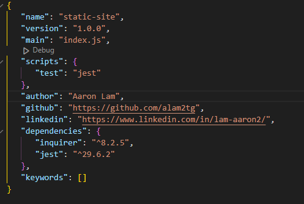

# Logo Generator
### by Aaron Lam

## License
	Licensed under the MIT license.

## Table of Contents
* [License](#license)
* [Description](#description)
* [Installation](#instillation)
* [Usage](#usage)
* [Contact-Me](#contact-me)
* [Credits](#credits)
* [Tests](#tests)
* [Questions](#questions)

## Description
This project was created to quickly generate logos using the command-line.

## Installation
The required technologies to install this project are Inquirer.js and Jest.js. Add the dependencies...
	"dependencies": {
		"inquirer": "^8.2.5",
		"jest": "^29.6.2"
	},
Then in the CLI, enter npm install. This will add the required modules. In the Index.js, make sure to require() the modules in the image.

## Usage
Javascript, Inquirer, Jest and the following sources are the documentation I used to build this project. Use the documentation as a reference for creating your own shapes, text, and Jest.js tests. To run the program, enter "index.js" in the command-line and answer the prompts (questions).

* [SVG Shapes](https://developer.mozilla.org/en-US/docs/Web/SVG/Tutorial/Basic_Shapes)
* [SVG Text](https://developer.mozilla.org/en-US/docs/Web/SVG/Tutorial/Texts)
* [Jest Test](https://jestjs.io/docs/expect)

## Contact Me
* Name - Aaron Lam
* Email - aaronlamfinance@gmail.com
* Github - 

## Credits
N/A

## Tests
Jest.js methods
expect().toEqual()
[Test Code](./images/test.png)

## Questions
Please send your questions [here](mailto:aaronlamfinance@gmail.com)